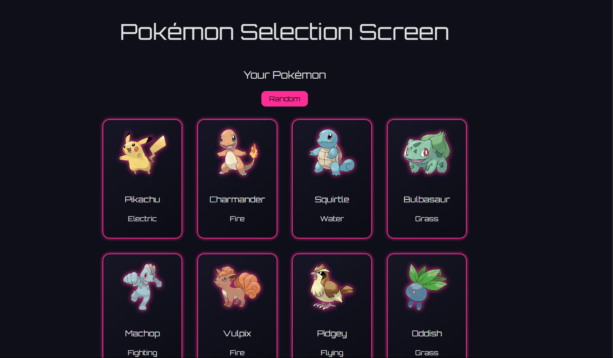
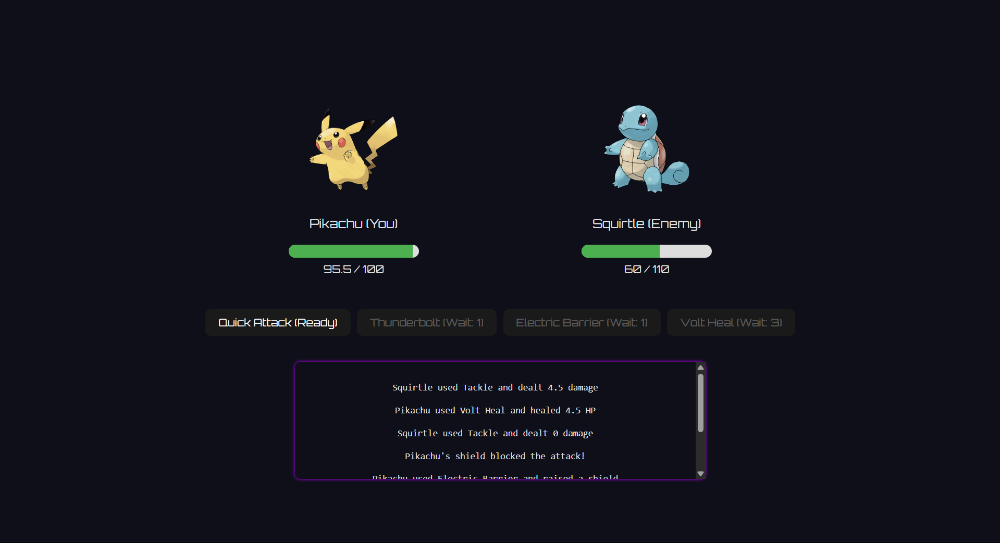
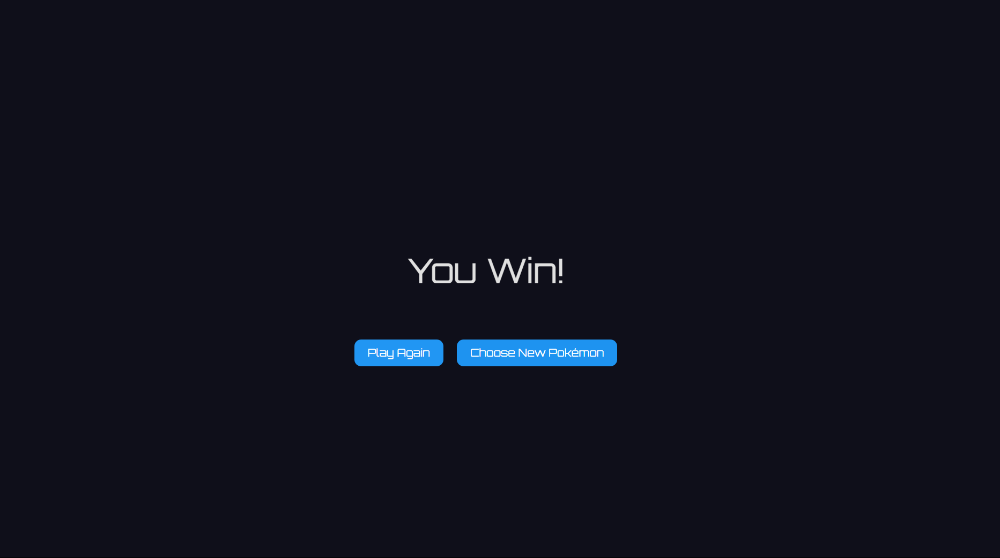
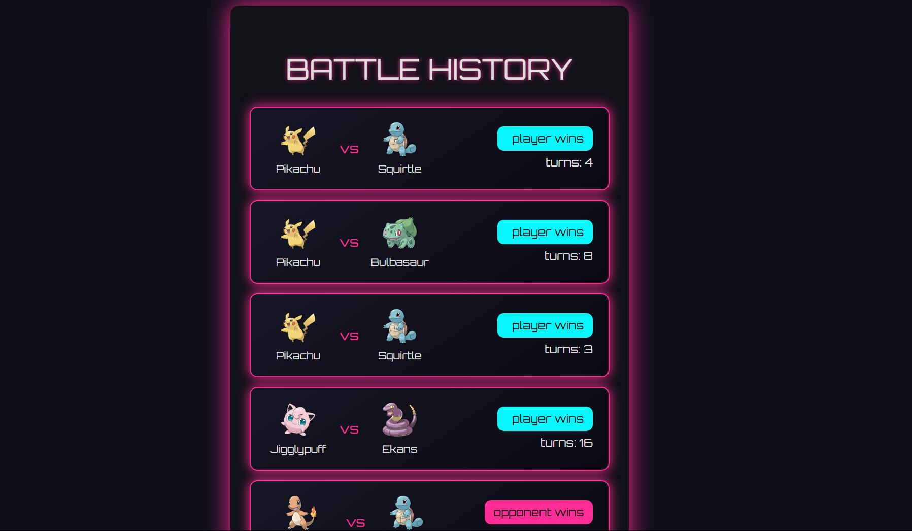
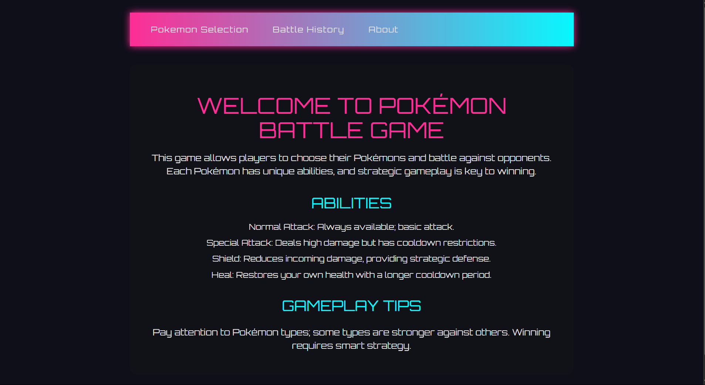

# ⚡ Pokemon Battle Game

Bu proje, **Vue 3** ve **Express.js** kullanılarak geliştirilen, strateji tabanlı bir Pokemon savaş oyunudur. Oyuncular kendi Pokemonlarını seçip rakiplerine karşı yeteneklerini kullanarak savaşır. Her savaş, type effectiveness, cooldown süreleri ve stratejik hamlelerle kazanılır.

---

## 📌 İçindekiler
- [Ekran Görüntüleri](#-ekran-görüntüleri)
- [Özellikler](#özellikler)
- [Kullanılan Teknolojiler](#kullanılan-teknolojiler)
- [Kurulum ve Çalıştırma](#kurulum-ve-çalıştırma)
- [Proje Yapısı](#proje-yapısı)
- [Oynanış Kılavuzu](#oynanış-kılavuzu)
- [İletişim](#iletişim)
- [Geliştirme Fikirleri](#-geliştirme-fikirleri)
- [Bilinen Hatalar](#-bilinen-hatalar)
- [Güncelleme Notları](#-güncelleme-notları)

---

## 📸 Ekran Görüntüleri

**Pokemon Seçimi**

---
**Savaş Ekranı**

---
**Savaş Sonucu Ekranı**

---
**Battle History Sayfası**

---
**About Sayfası**


---

## 🎮 Özellikler

- **Pokemon Seçimi:** Oyuncular kendi Pokemonlarını seçebilir veya rastgele atanmasını sağlayabilir.
- **Yetenekler:** Normal saldırı, özel saldırı, kalkan (savunma) ve iyileştirme yetenekleri sunar.
- **Cooldown Sistemi:** Bazı yeteneklerin tekrar kullanılabilmesi için bekleme süresi bulunur.
- **Type Effectiveness:** Pokemon türleri arasında güçlü/zayıf etkileşimler mevcuttur.
- **Savaş Logları:** Yapılan her hamle kayıt altına alınır ve oyuncuya gösterilir.
- **Geçmiş Savaşlar:** Önceki savaşların detaylı kayıtları incelenebilir.
- **Cyberpnuk Tema:** Pokemon temasını bozmayacak şekilde tasarlanmış hafif bir cyberpunk görselliği.

---

## 🛠️ Kullanılan Teknolojiler

**Frontend:**
- Vue 3
- Pinia (State Management)
- Vue Router
- Axios

**Backend:**
- Node.js
- Express.js

**Veri Depolama:**
- JSON dosyası (`battles.json`)

**Paket Yönetimi:**
- npm

---

## ⚙️ Kurulum ve Çalıştırma

### Gereksinimler

- Node.js (https://nodejs.org/)
- npm

### Kurulum Adımları
```
# 1. Projeyi klonlayın:
git clone <repo-url>
cd <repo-klasörü>

# 2. Backend kurulumu ve başlatma
cd backend
npm install
npm start

# 3. Yeni terminal açın ve frontend'e geçin
cd ../frontend
npm install
npm run dev
```
**4. Tarayıcıda açma:**

Frontend için: http://localhost:5173  
Backend için: http://localhost:3000

---

## 🗂️ Proje Yapısı
```
/
├── backend/
│   ├── api/              # API rotaları
│   ├── data/             # battles.json ve diğer veri dosyaları
│   └── server.js         # Express sunucu başlangıcı
│
├── frontend/
│   └── src/
│       ├── components/   # Vue bileşenleri (Navbar, PokemonCard, vb.)
│       ├── views/        # Sayfa bileşenleri (Home, Battle, Result, vb.)
│       ├── store/        # Pinia store dosyaları
│       └── main.js       # Uygulama başlangıcı
│
├── README.md
└── .gitignore
```

---

## 📘 Oynanış Kılavuzu
**1. Pokemon Seçimi:**  
Oyuncular, kartlardan birine tıklayarak Pokemon seçer veya Random butonunu kullanarak rastgele Pokemon alır.

**2. Savaş Başlatma:**  
İki taraf da seçim yaptıktan sonra Start Battle butonuna tıklayarak savaşı başlatır.

**3. Savaş Eylemleri:**  
Savaş ekranında dört farklı eylem vardır:

-Basic Attack (Cooldown yoktur)

-Special Attack (2 tur Cooldown)

-Shield (2 tur Cooldown)

-Heal (3 tur Cooldown)

**4. Savaş Günlüğü:**  
Yapılan her hareket ekranda detaylı olarak loglanır.

**5. Savaş Sonuçları:**  
Kazanan taraf, alınan hasar ve yapılan hamleler detaylı şekilde gösterilir.

**6. Battle History:**  
Ana menüdeki geçmiş sekmesinden önceki savaşlara göz atılabilir.

---

## 📬 İletişim
**Geliştirici:** Ahmet Emin Genç  
**E-posta:** ahmetemingenc8@gmail.com  
**GitHub:** https://github.com/ahmetemingenc

---

## 🎯 Geliştirme Fikirleri

- [ ] Her Pokemon için seviye ve evolve sistemi
- [ ] Gelişmiş animasyonlar ve ses efektleri
- [ ] Daha fazla Pokemon ve tür desteği
- [ ] Savaş ekranı için arka plan görseli
- [ ] Turnuva modu
- [ ] Stratejik derinliği arttırmak için perk sistemi
- [ ] Savaş sonrası istatistik ekranı (tur sayısı, alınan hasar vs.)
- [ ] Profil sayfası (toplam savaş, kazanma oranı, favori Pokemon gibi bilgiler)
- [ ] Basit kozmetikler (Pokemon kostümler, arena vs.) ve perk satın almak için mağaza sayfası

---

## 🐞 Bilinen Hatalar

Şu anda bilinen ve çözümü için uğraşılan hatalar:

- [ ] Savaş sırasında sayfa yenilenirse navbar dışında bir görsel kalmıyor
- [ ] Cooldown sisteminde, bazı durumlarda, yetenekler bir tur fazladan cooldownda kalıyor
- [ ] Rastgele seçilen Pokemonlar bazen aynı olabiliyor
- [ ] Rastgele seçilen Pokemonlar'ın ekranda ortalanması için kurulan scroll sistemi çalışmıyor

---

## 📌 Güncelleme Notları

### v1.0 - İlk Yayın (27 Mayıs 2025)
- Vue 3 + Express.js ile temel oyun yapısı tamamlandı
- Pokemon seçimi, savaş ekranı, savaş logu ve battle history eklendi

### v2.0 (31 Mayıs 2025)
- Animasyon efektleri eklendi
- Yeni Pokemon'lar ve türler eklendi
- Cyberpunk tema eklendi
- About sayfası eklendi
- Rastgele Pokemon seçmek için Random butonu eklendi

### v2.1 (2 Haziran 2025)
- README.md dosyası eklendi
- Ekran görüntüleri için screenshots klasörü ve ekran görüntüleri eklendi
